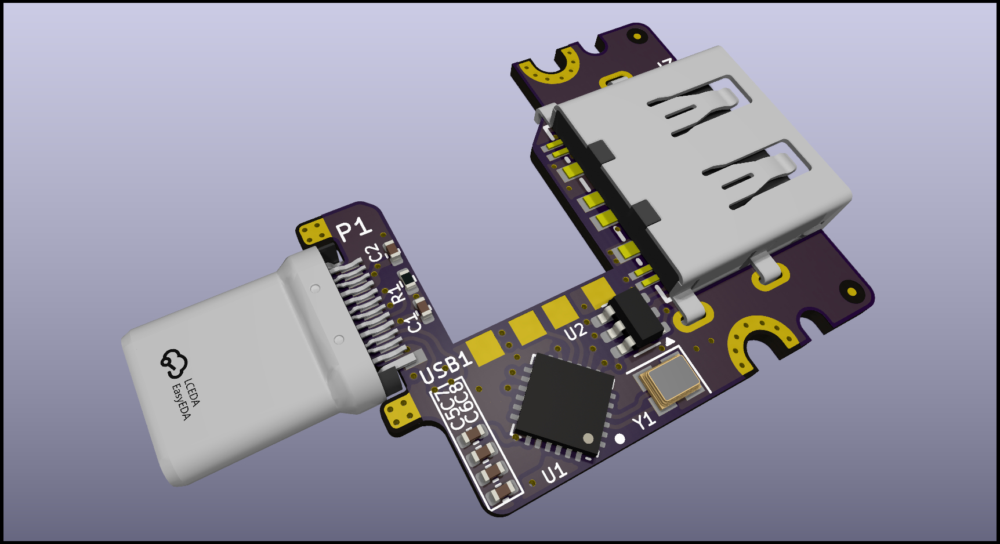
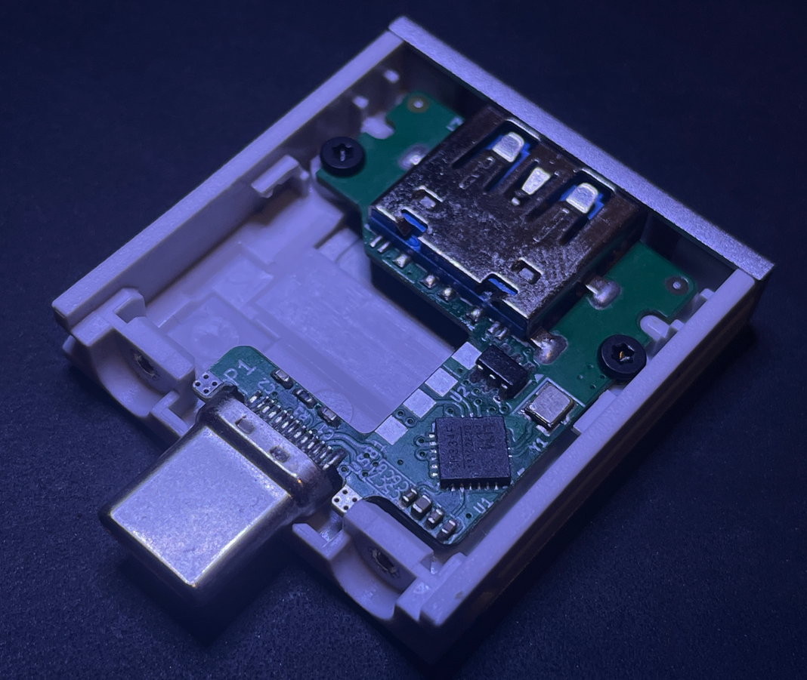

# DongleHider++ Framework Laptop Expansion Card

This is a fork of LeoDJ's dongle hider plus, it is a slight refinement of the design fitting it into a pcb that is compatible with a stock Framework USB C expansion card.

Simply (permanently) mount the dongle inside the card and still have an USB A port available!  

There even is room and solder pads for an additional dongle. Your imagination (and physics) are the only limits!

See LeoDJ's [thread on Mastodon about the build process etc](https://chaos.social/@LeoDJ/112040053271880119).

  &nbsp;
  

## Compatibility Notes

The expansion card was only tested on **Windows** and **AMD** Framework **13 and 16** laptops as of right now. There the following behaviour has been observed:
- With only a dongle active, the CH334 hub IC draws around 20mA. (In addition to the ~25mA of the Unifying dongle)
  - When nothing is connected to the hub, it goes to sleep and draws <1mA. (But this is seldomly the case with a dongle permanently attached to it :P )
- Despite earlier fears, the USB 3 "route-around-2.0-hub" topology doesn't seem to cause problems in the wild, except:
- When connected to a **USB4 capable expansion card slot** and an external **USB 3 device** is plugged in, the **internal dongle stops working**, but is still displayed as connected in Windows.
  - As soon as the USB 3 device gets unplugged, the internal dongle immediately begins to work again (probably without a re-enumeration).
  - USB 2 devices seem to work without a problem for the most part, although one of the tested USB thumb drives took a few re-plugs until it enumerated.
  - This behaviour is not seen on the other non-USB4-capable expansion card slots, there USB 3 devices work great alongside the internal dongle

It's currently unclear what the behaviour would be under Linux or on Intel laptops. [You can help expand this]
  

### Dongles

Please note that there may be mechanical differences between the original DongleHiderPlus and this pcb, I would reccomend 3D printing the pcb outline and checking the fit of your dongle.

The Unifying dongles can be disassembled pretty easily:
|||
|---|---|
|  | **Gen 1:**  Carefully break off the plastic from the metal part using a pair of pliers.  (Can be glued back together, if needed)|
|  | **Gen 2:**  Slide flat screwdriver (or similar) between the metal and the orange plastic of the front of the USB a plug and carefully pry open the metal shell until it slides off.  [Youtube video](https://www.youtube.com/watch?v=NB5uVCrXxT8) |

## PCB
- [View the latest schematic and board view]([https://kicanvas.org/?github=https%3A%2F%2Fgithub.com%2FLeoDJ%2FFW-EC-DongleHiderPlus%2Ftree%2Fmain%2FDongleHiderPlus_PCB](https://kicanvas.org/?github=https://github.com/s3841198/FW-EC-DongleHiderPlusPlus/blob/main/FrameworkDongleHiderRetrofit.kicad_pcb)) thanks to KiCanvas.
- I've ordered the PCB and assembled it myself, but it should be able to be mostly assembled by PCBA services (like JLCPCB) too. The Gerber/BOM/CPL files are provided in the [PCB/jlcpcb/production_files/](FW-EC-DongleHiderPlusPlus/tree/main/jlcpcb/production_files) folder.

## Mechanical Design

- The pcb is designed to be a drop in replacement for a stock Framework USB C expansion card, it uses the original screws and doesn't require any modifications to be made to the stock housing.
